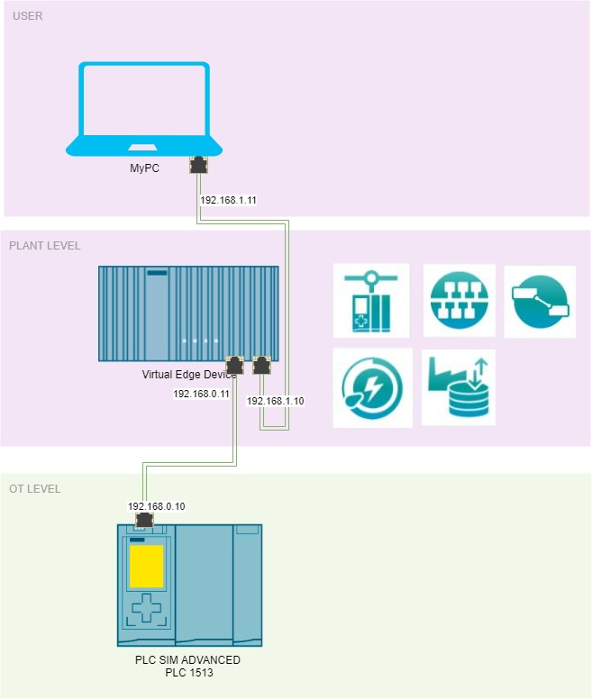
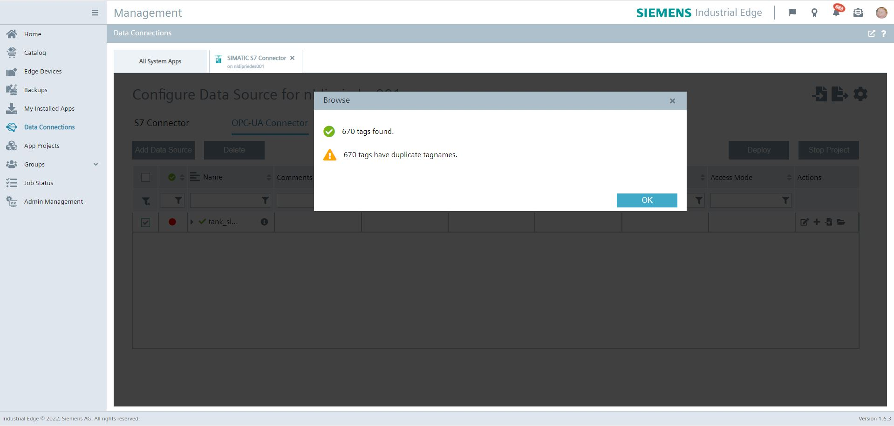

# Northbound southbound edge devices
Setting up Energy manager on Industrial Edge Device
[Official documentation](https://github.com/industrial-edge/energy-manager-getting-started)

## index

* [Overview](#overview)
  * [Setup](#setup)
* [Get Started](#get-started)
  * [Network](#network)
    * [OT Level](#ot-level)
    * [Plant Level](#plant-level)
  * [Apps](#apps)
    * [Simatic S7 Connector](#simatic-s7-connector)
    * [IE databus](#ie-databus)
    * [Flow Creator](#flow-creator)
    * [Energy Manager](#energy-manager)
      * [Heatmap](#heatmap) 

## Overview

### Setup

- Plant level
  - Connected to PORT 2 on edge device.

- OT Level edge device
  - Uses Port 1 for PC connection
  - Uses Port 2 for PLC connection
  - Applications
    - Dataservice - Saves data from southbound device in database    
    - IE Databus - Is used as data channel - MQTT broker      
    - SIMATIC S7 Connector - used for data retrieve from plc
    - Energy manager - Dashboarding of energy data  
    - Flow Creator - Debugging of dataflow
      
- OT Level PLC
  - [Uses Tia Tank sample application](https://github.com/industrial-edge/miscellaneous#tank-application)

# Get started

## Network
  - PLANT-USER network 192.168.1.x/24 range
  - PLANT-OT network 192.168.0.x/24 range  
  - Devices:
    - PLC: 
      - 192.168.0.10
    - Edge Device: 
      - port 1: 192.168.1.10
      - port 2: 192.168.0.11
    - MYPC :
      - port: 192.168.1.11     

### OT - Level
  Run Tia tank project on PLC SIM Advanced, or use a real PLC - Use a 1500 plc [Link Tia Portal Project](https://github.com/industrial-edge/miscellaneous#tank-application)  Or use your own project.  
  Give this PLC ip adress in range of the OT-South network, for example 192.168.0.10

## PLANT - Level
Install the required apps on edge device
- Simatic s7 Connector 
- IE Databus 
- Energy Manager
- Data Service
- flow creator
 
Setup the network settings  on edge device
  - Give the Edge-Device Port 2 ip adress in range of the OT-South network, for example 192.168.0.11
  - Give the Edge-Device Port 1 ip adress in range of the South-North network, for example 192.168.1.10

# Apps

## Simatic s7 Connector
1. Open the Industrial Edge Management - Go to Data Connections - Select the Simatic S7 connector

2. Launch on the Southbound device - select S7 or OPCUA (we use opcua) - add data Source 

3. Fill in the ip adress and port 192.168.0.10 port 4840 and save
4. Set the settings - use username: edge and password: edge, then press save.

5. A new row should be available in the list, press browse tags, all the tags should be read from the datasource. add all from the database GBD.

6. Deploy and start project, wait until done.

## IE Databus
1. Open the Industrial Edge Management - Go to Data Connections - Select the IE Databus
2. Launch on the Southbound device 
3. Add user + 

4. Topic: ie/#, username: edge, password: edge, permission: publish and subscribe, click on add.
5. Deploy, wait until its done

## Flow Creator
1. open flow creator - on edge device, login with edge credentials 
2. add mqtt in node
3. add server: 
    - server: ie-databus
    - port: 1883
    - security - user: edge
    - security - password: edge
    - click on save
    - 
4. set topic:
    - ie/#
    - click on done.
5. add message node and connect, then deploy.
6. check if data is flowing in debug window.

## Edgedevice - Dataservice 
1. Open Dataservice - on edge device.
2. Go set the adapter, connect the s7 adapter

3. Fill in fields:
   - name: s7 connector (default)
   - url: tcp://ie-databus:1883
   - name: edge
   - password: edge
   - metadata: ie/d/j/simatic/v1/s7c1/dp/   (default)
4. Click save
5. and enable the new adapter, check if it is connected.
6. Add child asset to edge : "Plant" 
7. Add child asset to plant : "Energy" 

8. Click on Energy Asset, and add multiple variables
9. Type in search: GDB.signals.energy
10. Select all the 4 tags. and save. > accept.

## Edgedevice - Energy Manager
1. Open Energy manager - on edge device
2. Create KPIs - add new KPI

    - Create KPI: name KPI_Total_Energy
        - Unit: Wh
        - Fill in Formula: operand EnergyFillingTank + Operand EnergyHeatingTank + Operand EnergyFIllingBottles

    - Create KPI: name KPI_Costs_energy
        - Unit: $ or euro
        - Formula: Operand TotalEnergy * constant 0.35

    - Create KPI: name KPI_Costs_Water
        - Unit: $ or euro
        - Formula: Operand TotalEnergy * constant 0.21

3. Create KPI Instance
   - Select My plant
   - go to the Energy - Asset
   - click on the dropdown and click on parameter

   - add new KPI instance
   - name: INSTANCE_Total_Energy
   - KPI basis:  On KPI type
   - KPI Type: KPI_Total_Energy
   - Connect EnergyFillingTank -> WaterConsumptionFillingTank
   - Connect EnergyHeatingTank -> ConsumptionHeatingTank
   - Connect EnergyFillingBottles -> ConsumptionFillingBottles

   

3. Open menu > My Plant
    - open tab > Plant > Energy> create dashboard
    - give it a name.

### Heatmap
4. Heatmap Option 1
Using the Heatmap, you can visualize the intensity of data values over time.

    - select the tab "Plant"
    - go to the newly created dashboard
    - select "Create first widget" to start the wizard
        - choose the Heatmap widget type > Continue
        - enter a widget name and set the KPI calculation period to 1 Minute > Continue
        - click "Select parameter" and choose the KPI instance for 'Total energy' > Continue
        - no need to change anything in the general display options > Continue
        - no need to change anything in the Heatmap display options > Finish

### Bulk Diagram

5. Diagram Option 2
Using the Diagram widget, you can display parameter values or calculated KPI values over time. There are several diagram types available. Also different aggregation functions can be selected for the values.

  - go to the dashboard
  - click the settings button and choose "New widget" to start the wizard
    - choose the Diagram widget type > Continue
    - enter a widget name and set the KPI calculation period to 15 Minutes > Continue
    - click "Select parameter" and choose the KPI instance for 'Total energy' > Continue
    - no need to change anything in the general display options > Continue
    - choose "Bar" in the dropdown field for the chart type > Finish

### Line Diagram

6. Line Diagram Option 3
Here we want to display the consumption costs for energy and water as line diagram

  - go to the dashboard
  - click the settings button and choose "New widget" to start the wizard
    - choose the Diagram widget type > Continue
    - enter a widget name and set the KPI calculation period to 15 Minutes > Continue
    - click "New KPI instance" to create an instance based on the KPI type 'Costs energy', enter a name, select the KPI type and link the parameter 'TotalEnergy' to the already existing instance of 'Total Energy'

    - Again click "New KPI instance" to create an instance based on the KPI type 'Costs water', enter a name, select the KPI type and link the parameter 'WaterConsumption' to the signal 'waterConsumptionFillingTank' with aggregation 'Last' > Continue

    - no need to change anything in the general display options > Continue
    - no need to change anything in the Chart display options > Finish

### Sankey Diagram

7. Sankey Diagram Option 4
Using the Sankey diagram, energy flows can be visualized.

  - go to the dashboard
  - click the settings button and choose "New widget" to start the wizard
      - choose the Sankey widget type > Continue
      - enter a widget name and set the KPI calculation period to 1 Minute > Continue
      - click "Select parameter" and choose the energy and water parameter (hint: choose them in the order you would like to see them in the diagram), for all set aggregation to 'Last' > Continue

      - no need to change anything in the general display options > Continue
      - in the tab 'Nodes' you need to create nodes with proper colours, that are later linked to the parameter:

      - go to the tab 'Links' and specify the links for each parameter from source node to destination node (you can also scale a link to show the proportions right):

      - finish

### Duration curve Diagram

8. Duration Curve Diagram Option 5
By using the duration curve, you can display a chart sorted by size.

  - go to the dashboard
  - click the settings button and choose "New widget" to start the wizard
    - choose the Duration Curve widget type > Continue
    - enter a widget name and set the KPI calculation period to 1 Minute > Continue
    - click "Select parameter" and choose the KPI instance for 'Total energy' > Continue
    - no need to change anything in the general display options > Continue
    - no need to change anything in the Heatmap display options > Finish

